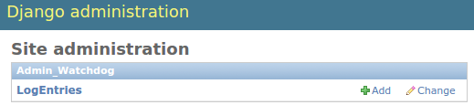
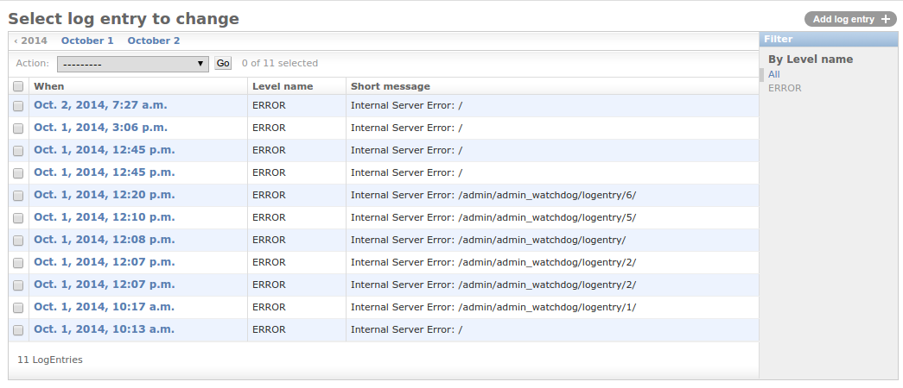
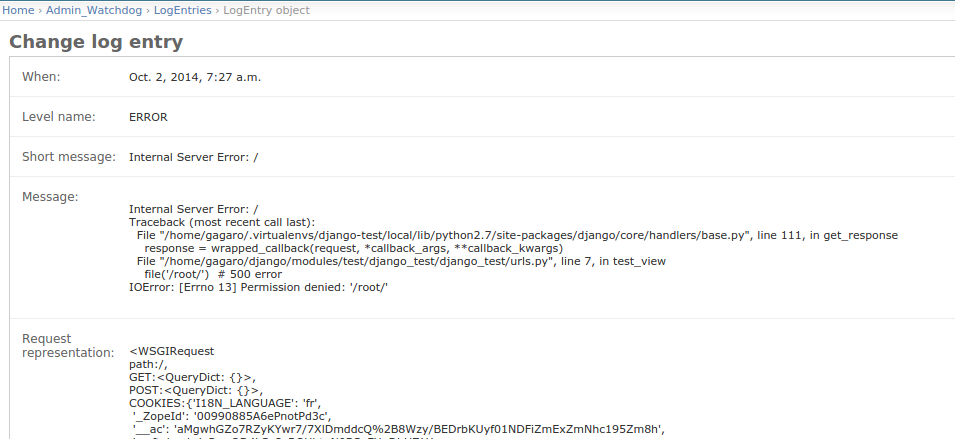

==============
Admin watchdog
==============

.. image:: https://travis-ci.org/makinacorpus/django-admin-watchdog.png
    :target: https://travis-ci.org/makinacorpus/django-admin-watchdog

.. image:: https://coveralls.io/repos/makinacorpus/django-admin-watchdog/badge.png?branch=master
    :target: https://coveralls.io/r/makinacorpus/django-admin-watchdog?branch=master

Admin watchdog is a simple Django app to register and view logs in the django admin backoffice.

Quick start
-----------

1. Add "admin_watchdog" to your INSTALLED_APPS settings.

2. Run `python manage.py migrate` to create the admin watchdog model.

3. Edit your LOGGING settings to use the admin watchdog handler.
   For example, to replace the default mail handler::

    LOGGING = {
        'version': 1,
        'disable_existing_loggers': False,
        'handlers': {
            'admin_watchdog': {
                'level': 'ERROR',
                'class': 'admin_watchdog.handlers.AdminWatchdogHandler',
            }
        },
        'loggers': {
            'django.request': {
                'handlers': ['admin_watchdog'],
                'level': 'ERROR',
                'propagate': False,
            }
        }
    }

4. Your error logs will now be registered. Visit your admin backoffice to see the log entries.

5. You can run the tests by doing `make test`.

Screenshots
===========

AUTHORS
=======

* Yann FOUILLAT (alias Gagaro) <yann.fouillat@makina-corpus.com>

|makinacom|_

.. |makinacom| image:: http://depot.makina-corpus.org/public/logo.gif
.. _makinacom:  http://www.makina-corpus.com

=======
LICENSE
=======

* GPLv3+
